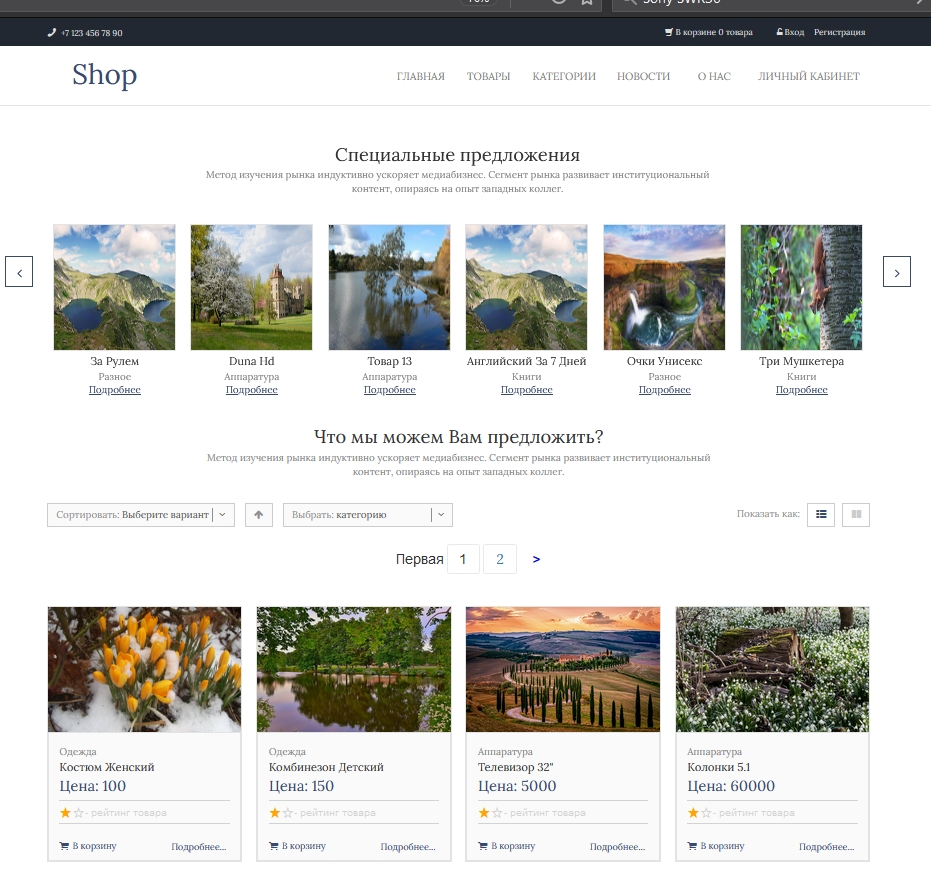

# Shop
- HTML
- CSS
- JS
- React JS 
 - Django==2.2
 - BD PostgresQL
 - готовый шаблон

**Install**
- pip install requirements.txt
1) На главной странице товары. Фильтрация по сумме и категории.Пагинация
2) Одна страница прорисована на  React JS Фильтрация по сумме, задается диапазон цен и категории.Пагинация
   {:height="36px" width="36px"}.